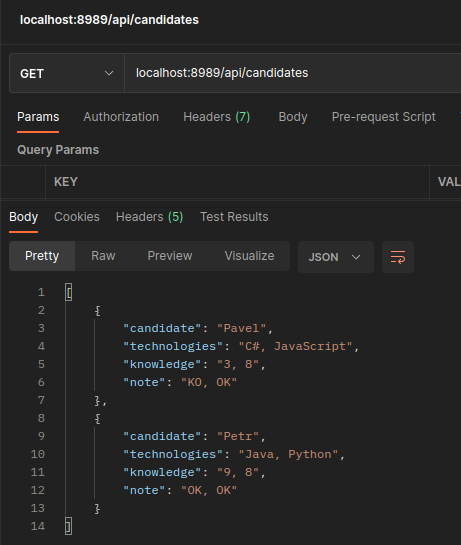
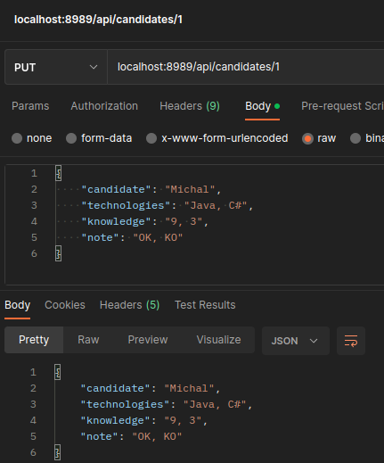
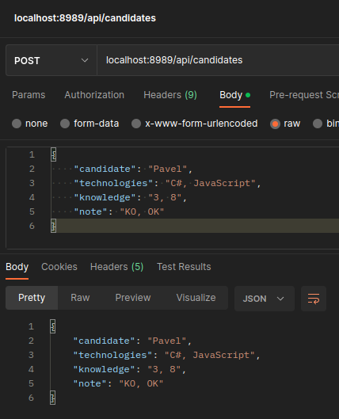
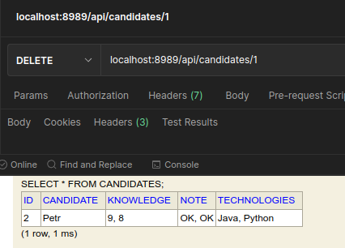
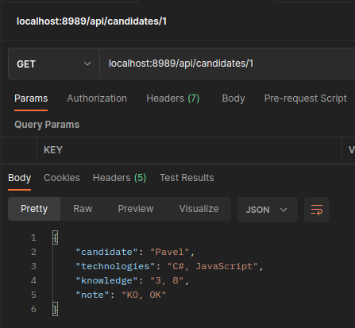
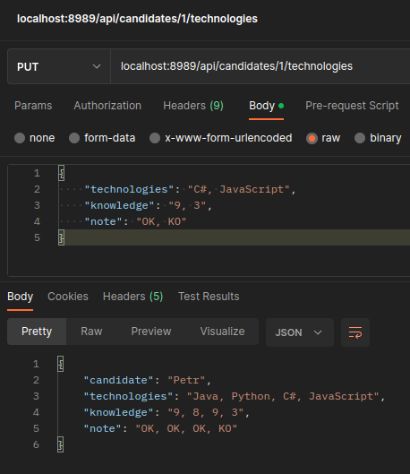
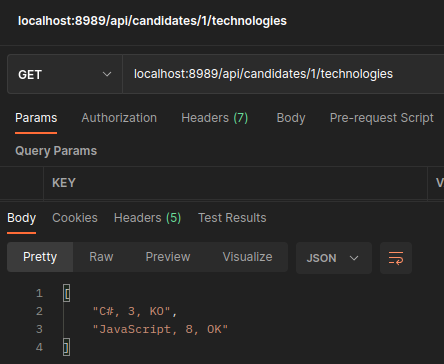

Hlavní třída je `src/main/java/com/example/case_study/CaseStudy.java`

Databáze h2, bez hesla:

```text
url:       http://localhost:8989/h2-console
JDBC URL:  jdbc:h2:mem:case_study
User Name: sa
Password:  
```

## API

| GET                                             | PUT                                                                      | POST                            | DELETE                              |
|-------------------------------------------------|--------------------------------------------------------------------------|---------------------------------|-------------------------------------|
|               |                                           |  |  | 
| Vypíše všechny uchazeče, včetně technologií     | **Přepíše** původní informace konkrétního uživatele                      | Přidá uchazeče                  | Smaže konkrétního uchazeče          |
|             |                                        |                                 |                                     |
| Vypíše konkrétního uchazeče, včetně technologií | **Přidá** k původním technologiím konkrétního uživatele nové technologie |                                 |                                     |
|            |                                                                          |                                 |                                     |
| Vypíše technologie konkrétního uchazeče         |                                                                          |                                 |                                     |  

